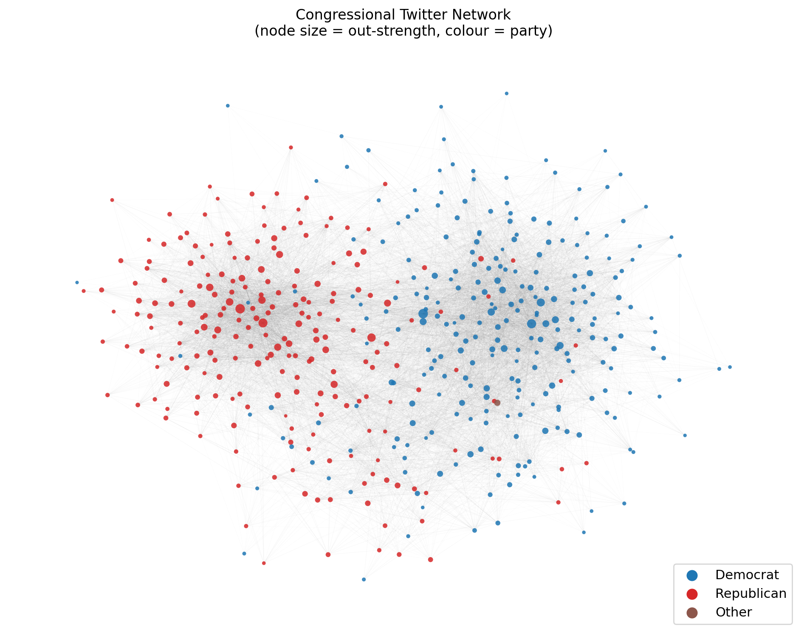
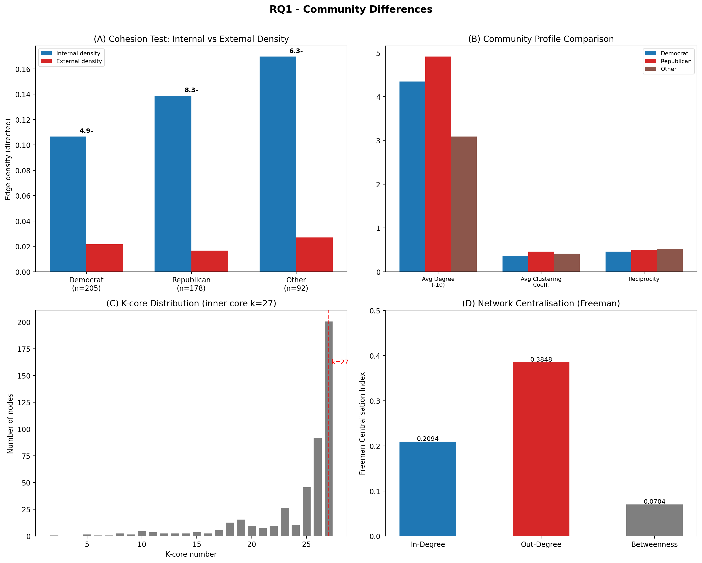
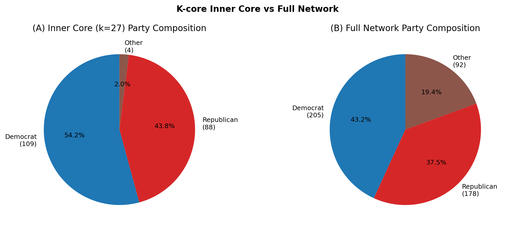
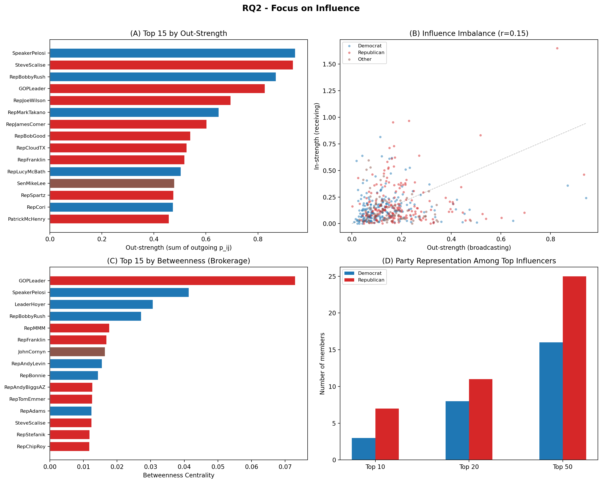
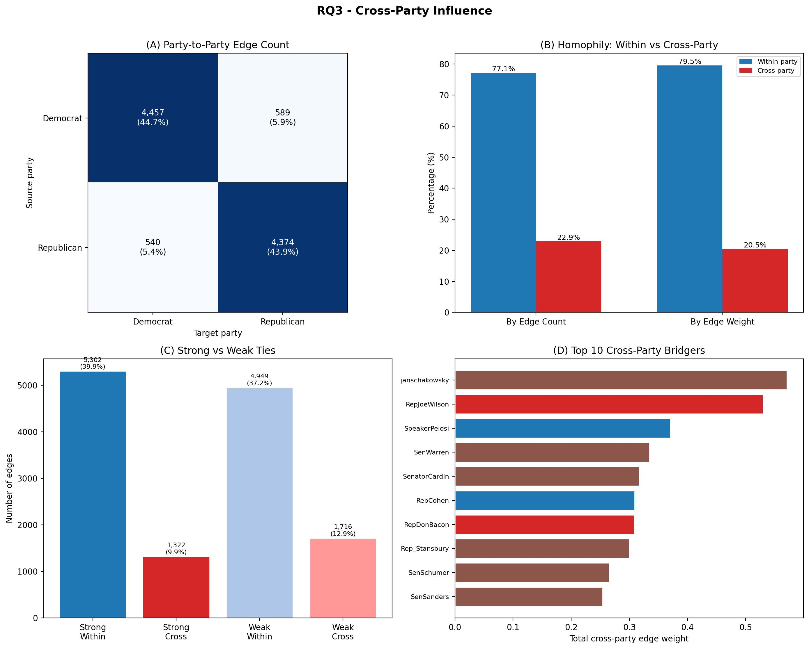
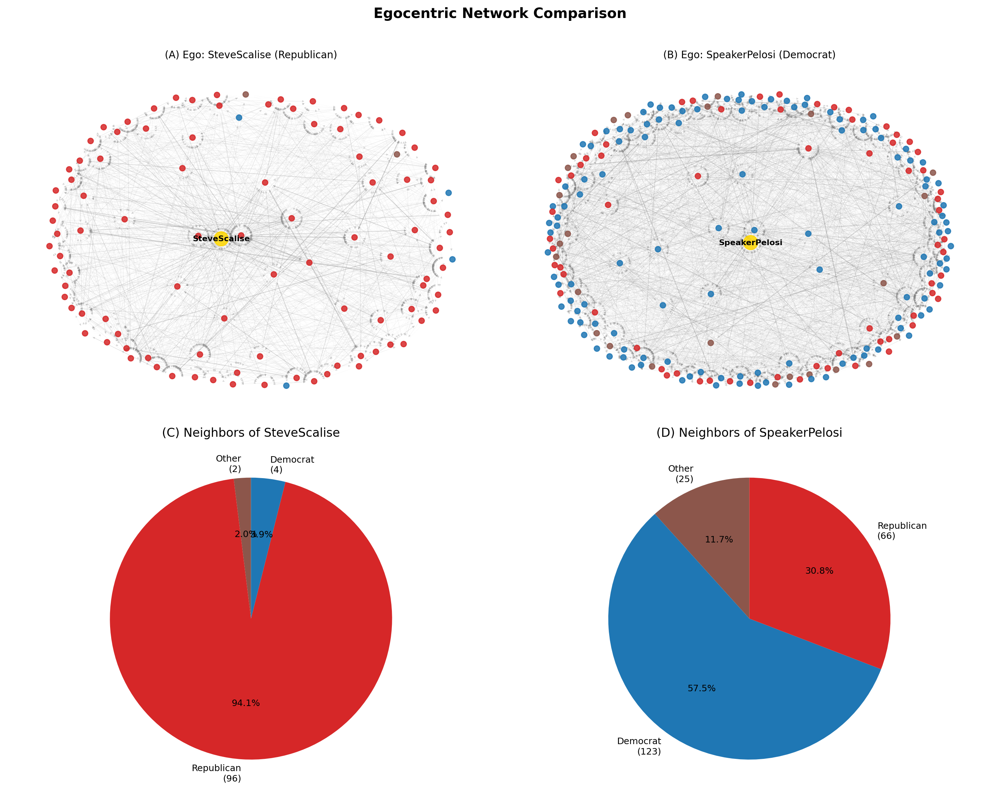
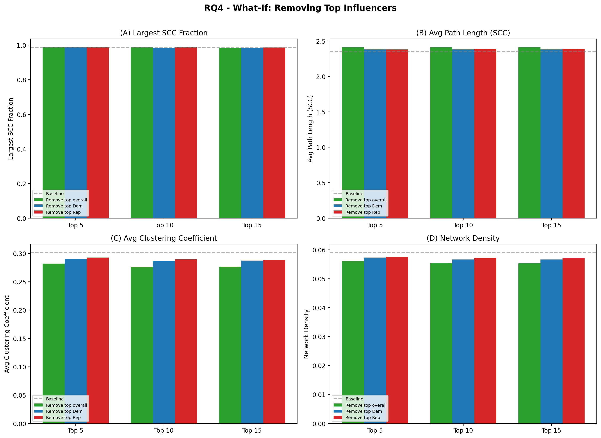
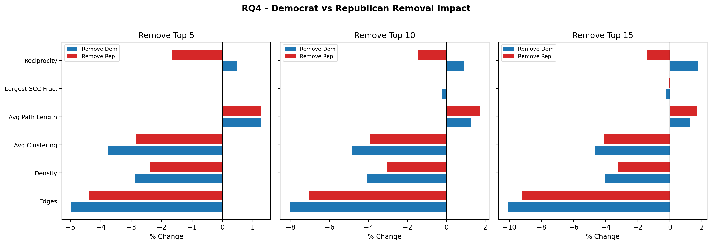

# TBA3241 Social Media Analytics
**AY25/26 Semester 2**

**Final Report**

**Group 1**

| Name | Matriculation |
|---|---|
| HAN LIHUI | A0265957J |
| LI XUAN | A0287600E |
| JERIN PAUL | A0227170M |
| ZHANG LONGSHENG | A0287626N |

---

## Table of Contents

1. [Executive Summary](#executive-summary)
2. [Data & Network Construction](#data--network-construction)
3. [Network Overview](#network-overview)
4. [Research Questions](#research-questions)
   - [RQ1: Community Differences](#rq1-community-differences)
   - [RQ2: Focus on Influence](#rq2-focus-on-influence)
   - [RQ3: Cross-Party Influence](#rq3-cross-party-influence)
   - [RQ4: What-if Questions](#rq4-what-if-questions)
5. [Implications](#implications)
6. [Conclusion and Limitations](#conclusion-and-limitations)
7. [Reproducibility](#reproducibility)
8. [References](#references)
9. [Declaration of AI Tool Usage](#declaration-of-ai-tool-usage)
10. [Appendix A](#appendix-a)

---

## Executive Summary

This report analyses the Twitter Interaction Network of the 117th U.S. Congress to understand how political influence flows among legislators on social media. Using a directed, weighted network of 475 members and 13,289 edges, we address four research questions covering community structure, individual influence, cross-party information flow, and network resilience to node removal.

Key findings:

- **Three cohesive party communities** exist. Internal edge density exceeds external density by 4.9--8.3x for all three groups, confirming that party affiliation drives network clustering. Republicans exhibit higher per-node density and clustering, while Democrats dominate the densest inner core (54.2% of k=27 core vs 43.2% of the network).
- **Influence is concentrated and asymmetric.** Out-degree centralisation (0.38) far exceeds betweenness centralisation (0.07), indicating a few high-volume broadcasters rather than strategic brokers dominate outreach. Republicans hold 7 of the top 10 Viral Centrality positions; GOPLeader uniquely combines the highest betweenness (0.073) and eigenvector centrality.
- **77% of edges stay within the same party.** Strong ties are even more partisan (80% within-party). No articulation points exist, yet a small set of cross-party bridgers carry disproportionate weight.
- **The network is resilient to targeted removal.** Removing the top 15 influencers reduces edges by 12% but barely changes the largest strongly connected component (98.5% intact), demonstrating distributed redundancy.

---

## Data & Network Construction

### Data Source

This study uses the **Twitter Interaction Network for the U.S. Congress**, obtained from the Stanford Network Analysis Project (SNAP). The dataset consists of publicly available Twitter interactions among members of the 117th U.S. Congress, originally collected via the Twitter API (Tweepy) as of 9 June 2022 (Fink, Omodt, Zinnecker, & Sprint, 2023).

For this project workflow, we load user metadata only from `congress_network/users 2.xlsx` (the older `users.xlsx` from the raw download is not used, because it is not aligned with current metadata). That file preserves the original columns and includes `State/District`, which is parsed into a normalised `State` field for state-level summaries.

### Data Cleaning

Tweets created outside the common observation window (9 February to 9 June 2022) were excluded. Members tweeting fewer than 100 times during this window were also excluded (Fink et al., 2023). The final dataset contains **475 active members** and **13,289 directed edges**.

Two forms of sampling bias are acknowledged:

1. **Activity bias** -- less-active members are excluded, over-representing highly engaged legislators.
2. **Temporal bias** -- the four-month snapshot may not reflect long-term stable interaction patterns.

### Network Construction

For each directed pair *(i, j)*, interactions (retweets, replies, mentions, quote tweets) by *i* toward *j* were counted and normalised by *i*'s total tweets in the window, giving **pairwise influence probability** \(p_{ij} = n_{ij}/T_i\) (Fink et al., 2023). The graph is **directed**, **weighted**, and **unimodal** (Congress members only); all 13,289 edges have \(p_{ij} > 0\).

Later sections use standard lecture concepts: **homophily**, edge **density**, **k-core**, **clustering**, **reciprocity**, strong/weak **ties** (Granovetter, 1973), **centralisation**, shortest-path **betweenness** / **closeness** / **eigenvector** centrality, and **WCC** / **SCC** / **articulation** points. **Strength** sums weights: \(s_i^{\text{out}} = \sum_j p_{ij}\), \(s_i^{\text{in}} = \sum_j p_{ji}\) (Barrat et al., 2004).

| Term | Definition |
|---|---|
| Out-degree | Distinct members a node links *to* |
| In-degree | Distinct members linking *to* a node |
| Out-strength | \(\sum_j p_{ij}\) (broadcasting intensity) |
| In-strength | \(\sum_j p_{ji}\) (attention received; can exceed 1) |

**Viral Centrality (VC)** (Fink et al., Physica A, 2023) uses the same \(p_{uv}\) as Independent Cascade transmission probabilities; VC is expected activated mass normalised by \(N\). We use \(p_{ij}\) for edge-level questions (RQ3), **out-strength** for broadcasting comparisons, and **VC** for influence tiers and removal scenarios (RQ2, RQ4). With mean path length 2.35, out-strength and VC correlate strongly (\(r > 0.95\)).

$$\text{VC}_i \;=\; \frac{1}{N} \sum_{j=1}^{N} \Pr(\text{node } j \text{ activated} \mid \text{seed } = i)$$

---

## Network Overview

| Metric | Value |
|---|---|
| Nodes | 475 |
| Directed edges | 13,289 |
| Average in/out-degree | 27.98 |
| Average edge weight | 0.0058 |
| Graph density | 0.059 |
| Reciprocity | 0.46 |
| Weakly connected components | 1 |
| Strongly connected components | 7 |
| Largest SCC size | 469 / 475 (98.7%) |
| Diameter (largest SCC) | 6 |
| Average path length (SCC) | 2.35 hops |
| Average clustering coefficient | 0.30 |

One WCC; 98.7% of nodes in the largest SCC. Short paths (2.35) and high clustering (0.30 vs \(\sim\)0.06 in a comparable random graph) \(\Rightarrow\) **small-world**. Reciprocity 0.46.

| Party | Nodes | Share |
|---|---|---|
| Democrat | 254 | 53.5% |
| Republican | 220 | 46.3% |
| Independent | 1 | 0.2% |

| Chamber | Nodes | Share |
|---|---|---|
| House | 383 | 80.6% |
| Senate | 92 | 19.4% |

*Note: Updated metadata in `users 2.xlsx` includes chamber labels for all 475 nodes.*



*Figure 1 — Layout: node size = out-strength, colour = party.*

---

## Research Questions

### RQ1: Community Differences

*How can Congress members be categorised on Twitter, and how do these groups differ from one another? Is the network centralised around a few dominant members?*

#### Q1.1--Q1.2: Categorisation and community differences

**Approach.** Communities by **party** (homophily); validate with internal vs external **directed density**.

**Cohesion.** A group is **cohesive** if internal density \(\gg\) density of edges to outsiders.

| Community | Size | Internal density | External density | Ratio |
|---|---|---|---|---|
| Democrat | 205 | 0.1066 | 0.0217 | **4.9x** |
| Republican | 178 | 0.1388 | 0.0167 | **8.3x** |
| Other | 92 | 0.1696 | 0.0271 | **6.3x** |

All three groups pass the cohesion test by a wide margin. Republicans have the highest internal density (0.139) and the largest ratio (8.3x), indicating the tightest within-group connectivity.

**Per-community structural profiles:**

| Metric | Democrat | Republican | Other |
|---|---|---|---|
| Nodes | 205 | 178 | 92 |
| Internal edges | 4,457 | 4,374 | 1,420 |
| Avg degree (directed) | 43.5 | 49.1 | 30.9 |
| Avg clustering coefficient | 0.362 | 0.457 | 0.412 |
| Avg edge weight | 0.00514 | 0.00693 | 0.00578 |
| Reciprocity | 0.462 | 0.499 | 0.525 |

Republicans show higher degree, clustering, mean weight, and reciprocity than Democrats within their block; the Other group has the highest reciprocity (0.525).

**K-core.** Maximal subgraph where every node has degree at least *k*; increasing *k* peels to the dense core.

At k=27, **201 nodes** remain:

| Party | In k=27 core | Share of core | Share of full network |
|---|---|---|---|
| Democrat | 109 | **54.2%** | 43.2% |
| Republican | 88 | **43.8%** | 37.5% |
| Other | 4 | 2.0% | 19.4% |

Democrats are overrepresented in the inner core by 11 percentage points (54.2% vs 43.2%), suggesting broader structural coordination across a larger group. Republicans, while having higher per-node density, concentrate their tight connectivity in a smaller, denser cluster rather than a broad backbone.

---

#### Q1.3--Q1.4: Network centralisation

**Approach.** Centralisation compares the network to a star (1) vs uniform (0); three directed variants.

| Centralisation type | Value | Interpretation |
|---|---|---|
| In-degree | 0.2094 | Moderate: some members attract many more incoming ties than average |
| **Out-degree** | **0.3848** | **High: a few members broadcast to far more peers than average** |
| Betweenness | 0.0704 | Low: no single node monopolises shortest paths |

**Out-degree centralisation (0.38)** dominates: a few members broadcast widely (**SpeakerPelosi** 210 out-edges; **GOPLeader** 195). **Betweenness centralisation (0.07)** is low—no narrow brokerage core; many shortest-path alternatives exist.



*Figure 2 -- RQ1 summary. (A) Cohesion test: all three party groups have internal density far exceeding external density. (B) Community profiles: Republicans have higher average degree, clustering, and reciprocity. (C) K-core distribution with inner core at k=27. (D) Centralisation indices.*



*Figure 3 -- K-core inner core (k=27) party composition vs full network. Democrats are overrepresented in the inner core (54.2% vs 43.2%).*

**RQ1 —** Three cohesive party communities (4.9--8.3x internal vs external density). Republicans: tighter intra-party ties; Democrats: overrepresented in the k=27 core. Centralisation is driven by **broadcasting** (out-degree 0.38), not **brokerage** (betweenness 0.07).

---

### RQ2: Focus on Influence

*Who are the most influential members, and is influence balanced across parties?*

#### Q2.1: Most influential members

**Approach.** Rank all nodes by degree, closeness, betweenness, eigenvector, **out-strength**, **in-strength**, and **Viral Centrality (VC)** (IC cascade on \(p_{uv}\); Fink et al., 2023).

**Top 10 by Viral Centrality:**

| Rank | Member | Party | VC | Betweenness | Out-Strength |
|---|---|---|---|---|---|
| 1 | SteveScalise | Republican | 1.146 | 0.013 | 0.935 |
| 2 | SpeakerPelosi | Democrat | 1.112 | 0.041 | 0.944 |
| 3 | RepBobbyRush | Democrat | 1.007 | 0.027 | 0.869 |
| 4 | GOPLeader | Republican | 0.980 | **0.073** | 0.827 |
| 5 | RepJoeWilson | Republican | 0.810 | 0.005 | 0.695 |
| 6 | RepJamesComer | Republican | 0.784 | 0.001 | 0.603 |
| 7 | RepMarkTakano | Democrat | 0.781 | 0.002 | 0.650 |
| 8 | RepBobGood | Republican | 0.687 | 0.001 | 0.541 |
| 9 | RepCloudTX | Republican | 0.674 | 0.000 | 0.526 |
| 10 | RepFranklin | Republican | 0.646 | 0.017 | 0.518 |

**SteveScalise** and **SpeakerPelosi** lead VC; **GOPLeader** has the highest betweenness (0.073) and eigenvector—**broker** role. Top betweenness: GOPLeader, SpeakerPelosi, LeaderHoyer, RepBobbyRush.

#### Q2.2: Influence imbalance

**Approach.** Compare out-strength (broadcast) vs in-strength (receive); high out / low in = **unidirectional broadcaster**.

| Metric | Value |
|---|---|
| Network reciprocity | 0.46 |
| Median out/in strength ratio | 1.13 |
| Correlation (out-strength, in-strength) | **0.15** |

**r(out-strength, in-strength) = 0.15** — broadcasters \(\neq\) top receivers (e.g. SpeakerPelosi high out, lower in; GOPLeader highest in-strength 1.65).

#### Q2.3: Party balance among top influencers

| Tier | Democrat | Republican | Other |
|---|---|---|---|
| Top 10 by VC | 3 (30%) | 7 (70%) | 0 |
| Top 20 by VC | 6 (30%) | 13 (65%) | 1 |
| Top 50 by VC | 16 (32%) | 28 (56%) | 6 |

Republicans are overrepresented in top VC tiers (Democrats 43.2% of network vs 30% of top 10), consistent with tighter Republican subgraph and cascade amplification.



*Figure 4 — (A) Top 15 by VC by party. (B) Out- vs in-strength (r=0.15). (C) Top 15 betweenness. (D) Party counts in top N.*

**RQ2 —** Leadership roles align with VC/betweenness. Broadcasting and receiving diverge (r=0.15). Republicans hold 70% of top-10 VC despite 37.5% of nodes.

---

### RQ3: Cross-Party Influence

*To what extent does influence cross party lines, and who bridges the divide?*

#### Q3.1 + Q3.3: Within- vs cross-party influence

**Approach.** Tag each edge within- or cross-party; split by count and total weight. **Strong** / **weak** ties split at median weight 0.0037 (Granovetter, 1973).

| Measure | Within-party | Cross-party |
|---|---|---|
| By edge count | **77.1%** (10,251) | 22.9% (3,038) |
| By edge weight | **79.5%** | 20.5% |
| Strong ties | **80.0%** within | 20.0% cross |
| Weak ties | 74.3% within | 25.7% cross |

**Homophily:** 77--80% of influence stays within party; strong ties are more partisan than weak ties (bridge more across groups).

**Party-to-party directed flow (Democrat and Republican only):**

| Source | Target | Edges | Share of D/R edges |
|---|---|---|---|
| Democrat | Democrat | 4,457 | 44.7% |
| Republican | Republican | 4,374 | 43.9% |
| Democrat | Republican | 589 | 5.9% |
| Republican | Democrat | 540 | 5.4% |

Cross-party flow is roughly symmetric: Democrats send 589 edges to Republicans; Republicans send 540 to Democrats.

---

#### Q3.2: Bridging nodes

**Approach.** **Articulation points** on the undirected skeleton; **cross-party bridgers** by total cross-party weight (in+out) and betweenness.

**Articulation points: 0** — no single cut-vertex; resilient skeleton.

**Top 5 cross-party bridgers:**

| Rank | Member | Party | Cross-party weight | Betweenness |
|---|---|---|---|---|
| 1 | janschakowsky | Other | 0.571 | 0.004 |
| 2 | RepJoeWilson | Republican | 0.530 | 0.005 |
| 3 | SpeakerPelosi | Democrat | 0.371 | 0.041 |
| 4 | SenWarren | Other | 0.335 | 0.008 |
| 5 | SenatorCardin | Other | 0.317 | 0.004 |

Other-labelled members often rank high as bridgers; among major-party members, **RepJoeWilson** leads cross-party weight; **SpeakerPelosi** combines cross-party weight with betweenness.



*Figure 5 — D/R heatmap; within-party shares; strong vs weak ties; top cross-party bridgers.*

#### Egocentric illustration (top VC: Scalise vs Pelosi)

| Metric | SteveScalise (R) | SpeakerPelosi (D) |
|---|---|---|
| Unique neighbors | 102 | 214 |
| Out-degree | 89 | 210 |
| In-degree | 63 | 51 |
| Out-strength | 0.935 | 0.944 |
| In-strength | 0.460 | 0.240 |
| Same-party neighbors | **94.1%** | 57.5% |
| Cross-party neighbors | 5.9% | **42.5%** |
| Ego network density | **0.194** | 0.099 |

**Scalise:** intra-party amplifier (94% same-party neighbours, ego density 0.194). **Pelosi:** cross-party hub (42.5% cross-party neighbours, sparser ego 0.099).



*Figure 6 — Ego nets and party mix (Scalise vs Pelosi).*

**RQ3 —** Strong within-party homophily (77--80%); bridgers sustain limited cross-party flow (589 D\(\to\)R vs 540 R\(\to\)D edges).

---

### RQ4: What-if Questions

*What if we remove the top influencers? How does the network structure change, and what does this imply for each party?*

**Approach.** Remove top 5 / 10 / 15 by VC: **(A)** overall, **(B)** Democrats only, **(C)** Republicans only. Track largest SCC share, mean path length, clustering, density.

**Key results (removing top 15):**

| Metric | Baseline | Remove 15 overall | Remove 15 Dem | Remove 15 Rep |
|---|---|---|---|---|
| Edges | 13,289 | 11,668 (-12.2%) | 11,947 (-10.1%) | 12,060 (-9.2%) |
| Largest SCC fraction | 98.7% | 98.5% | 98.5% | 98.7% |
| Avg path length | 2.35 | 2.41 (+2.6%) | 2.38 (+1.3%) | 2.39 (+1.7%) |
| Avg clustering | 0.301 | 0.277 (-8.1%) | 0.287 (-4.7%) | 0.289 (-4.1%) |
| Density | 0.059 | 0.055 (-6.3%) | 0.057 (-4.1%) | 0.057 (-3.2%) |
| SCC count | 7 | 8 | 8 | 7 |

**Observations:** Resilience: SCC drops only 0.2 pp after removing top 15. Overall removals hit clustering (-8.1%) and density (-6.3%) most (high-VC hubs carry many edges); SCC/path length barely move. Removing top Dems costs more edges (-10.1% vs -9.2% Reps) and can lower diameter (6\(\to\)5); removing Reps disrupts less (redundant intra-party paths).

**Removed members:**

| Scenario | Top 5 removed |
|---|---|
| Overall | SteveScalise, SpeakerPelosi, RepBobbyRush, GOPLeader, RepJoeWilson |
| Top Dem | SpeakerPelosi, RepBobbyRush, RepMarkTakano, RepLucyMcBath, RepCori |
| Top Rep | SteveScalise, GOPLeader, RepJoeWilson, RepJamesComer, RepBobGood |

#### Changes to edge weight (supplementary check)

Following the draft report's supplementary what-if idea, we also consider scaling transmission probabilities (e.g. 0.5x to 1.5x). This does not change graph topology (same nodes/edges), so connectivity metrics stay stable, but it changes diffusion magnitude (VC levels). In line with the draft, high transmission increases average/max VC while the top-influencer hierarchy remains broadly stable.



*Figure 7 — % change vs baseline (edges, clustering, SCC, etc.).*



*Figure 8 — Dem vs Rep removals at 5 / 10 / 15.*

**RQ4 —** No removal scenario fragments the network; influence is **distributed**. Dem removals remove slightly more edges; neither party collapses—caucuses benefit from **many** voices, not one hub.

---

## Implications

1. **Echo chambers.** 77--80% within-party flow implies Twitter is mainly intra-party amplification; designers can target low cross-party exposure. Leverage bridgers (e.g. RepJoeWilson, SpeakerPelosi) for cross-partisan reach.

2. **Two influence modes.** High-VC members (e.g. Scalise, RepBobbyRush) amplify *within* party; high-betweenness members (GOPLeader, SpeakerPelosi) sit on cross-party paths. A **two-stage** plan—broker across parties, then amplifiers within—matches this structure.

3. **Resilience.** RQ4 shows no collapse when hubs are removed; parties gain more from **many** credible voices than from one spokesperson.

---

## Conclusion and Limitations

### Summary of Findings

| Research Question | Key Finding |
|---|---|
| **RQ1: Community** | Three cohesive party communities (4.9--8.3x density ratio). Republicans: tighter per-node connectivity. Democrats: broader inner-core presence. Out-degree centralisation (0.38) dominates over betweenness (0.07). |
| **RQ2: Influence** | Top influencers mirror real-world leadership. VC and out-strength are weakly correlated with in-strength (r=0.15). Republicans hold 70% of top-10 VC positions. |
| **RQ3: Cross-party** | 77--80% of edges are within-party. Strong ties are even more partisan (80%). No articulation points. Small set of bridgers connects communities. |
| **RQ4: What-if** | Network resilient to targeted removal. Removing 15 top nodes reduces edges by 9--12% but SCC barely changes. Both parties show structural redundancy. |

### Limitations

1. **Temporal snapshot:** four months in 2022; behaviour may differ around elections or votes.
2. **Activity bias:** \(\geq\)100-tweet threshold excludes quieter accounts.
3. **No content layer:** weights reflect interaction *volume*, not sentiment or topic.
4. **Labels:** residual **Other** party/chamber coding (see metadata) can bundle heterogeneous members.
5. **Unweighted shortest paths:** betweenness/closeness use hop counts; weights are probabilities, not distances—using them as edge “lengths” would need a separate definition.

---

## Reproducibility

**Python 3.11:** NetworkX, matplotlib, numpy, openpyxl. Scripts in `codes/` (run in order):

```bash
cd "group project/codes"
python3 01_network_overview.py
python3 02_rq1_community.py
python3 03_rq2_influence.py
python3 04_rq3_cross_party.py
python3 05_rq4_whatif.py
python3 06_egocentric.py
```

Outputs: `codes/figures/`, `codes/results/`.

**Gephi:** directed **GEXF** matches the analysis graph—regenerate from the SNAP edgelist with `congress_network/convert_to_gexf_directed.py` (preserves direction and weights), then import `congress_directed.gexf` into Gephi for layouts and visual checks.

### Reproducing what-if analysis

`codes/05_rq4_whatif.py` reproduces node-removal scenarios (overall / Democrat / Republican at 5/10/15 nodes) and writes `codes/results/rq4_whatif.json`.  
The script reports structural metrics on the directed network (SCC fraction, path length, clustering, density).  
The supplementary edge-weight scaling note above mirrors the draft's scenario framing and can be implemented as an extension on top of the same directed graph.

---

## References

Barrat, A., Barth-lemy, M., Pastor-Satorras, R., & Vespignani, A. (2004). The architecture of complex weighted networks. *Proceedings of the National Academy of Sciences, 101*(11), 3747-3752.

Fink, C. G., Omodt, N., Zinnecker, S., & Sprint, G. (2023). A Congressional Twitter network dataset quantifying pairwise probability of influence. *Data in Brief, 50*, 109521.

Fink, C., Fullin, K., Gutierrez, G., Omodt, N., Zinnecker, S., Sprint, G., & McCulloch, S. (2023). A centrality measure for quantifying spread on weighted, directed networks. *Physica A, 626*, 129083.


Granovetter, M. S. (1973). The strength of weak ties. *American Journal of Sociology, 78*(6), 1360--1380.

Stanford University. (n.d.). *SNAP: Network datasets: Twitter Interaction Network for the US Congress.* https://snap.stanford.edu/data/congress-twitter.html

---

## Declaration of AI Tool Usage

| AI Tool | How it was used |
|---|---|
| AI language model (large language model assistant) | Assisted with writing Python analysis scripts, structuring the Markdown report, and generating figure-production code. All analytical interpretations, research questions, and conclusions were reviewed and verified by the group. |

---

## Appendix A

### Full Centrality Table (Top 20)

Full 475-node table available at: `codes/results/rq2_centrality_full.csv`

| Username | Party | Out-Deg | In-Deg | Out-Str | In-Str | Betweenness | Closeness | Eigenvector | VC |
|---|---|---|---|---|---|---|---|---|---|
| SteveScalise | Republican | 187 | 118 | 0.935 | 0.642 | 0.013 | 0.479 | 0.120 | 1.146 |
| SpeakerPelosi | Democrat | 210 | 94 | 0.944 | 0.278 | 0.041 | 0.479 | 0.094 | 1.112 |
| RepBobbyRush | Democrat | 173 | 113 | 0.869 | 0.374 | 0.027 | 0.464 | 0.111 | 1.007 |
| GOPLeader | Republican | 195 | 127 | 0.827 | 1.648 | 0.073 | 0.476 | 0.267 | 0.980 |
| RepJoeWilson | Republican | 153 | 82 | 0.695 | 0.255 | 0.005 | 0.459 | 0.085 | 0.810 |
| RepJamesComer | Republican | 140 | 76 | 0.603 | 0.302 | 0.001 | 0.451 | 0.074 | 0.784 |
| RepMarkTakano | Democrat | 151 | 107 | 0.650 | 0.271 | 0.002 | 0.455 | 0.073 | 0.781 |
| RepBobGood | Republican | 133 | 74 | 0.541 | 0.197 | 0.001 | 0.447 | 0.066 | 0.687 |
| RepCloudTX | Republican | 130 | 68 | 0.526 | 0.217 | 0.000 | 0.446 | 0.066 | 0.674 |
| RepFranklin | Republican | 138 | 127 | 0.518 | 0.830 | 0.017 | 0.453 | 0.130 | 0.646 |
| RepLucyMcBath | Democrat | 135 | 90 | 0.459 | 0.342 | 0.004 | 0.445 | 0.084 | 0.581 |
| RepSpartz | Republican | 109 | 81 | 0.415 | 0.413 | 0.004 | 0.437 | 0.074 | 0.537 |
| SenMikeLee | Other | 110 | 68 | 0.383 | 0.185 | 0.002 | 0.438 | 0.052 | 0.522 |
| RepCori | Democrat | 114 | 79 | 0.424 | 0.233 | 0.003 | 0.442 | 0.067 | 0.516 |
| VernBuchanan | Republican | 107 | 77 | 0.375 | 0.319 | 0.008 | 0.437 | 0.070 | 0.510 |
| PatrickMcHenry | Republican | 106 | 91 | 0.377 | 0.527 | 0.009 | 0.436 | 0.089 | 0.500 |
| RepJohnKatko | Republican | 107 | 78 | 0.358 | 0.303 | 0.004 | 0.436 | 0.063 | 0.476 |
| RepRichHudson | Republican | 101 | 113 | 0.354 | 0.722 | 0.013 | 0.435 | 0.105 | 0.468 |
| rosadelauro | Democrat | 110 | 68 | 0.395 | 0.198 | 0.002 | 0.441 | 0.061 | 0.466 |
| replouiegohmert | Republican | 93 | 94 | 0.329 | 0.605 | 0.004 | 0.429 | 0.081 | 0.437 |
