# TBA3241 Social Media Analytics
**AY25/26 Semester 2**

**Final Report**

**Group 1**

| Name | Matriculation |
|---|---|
| HAN LIHUI | A0265957J |
| LI XUAN | A0287600E |
| JERIN PAUL | A0227170M |
| ZHANG LONGSHENG | A0287626N |

---

## Table of Contents

1. [Executive Summary](#executive-summary)
2. [Data & Network Construction](#data--network-construction)
   - [Data Source](#data-source)
   - [Data Cleaning](#data-cleaning)
   - [Network Construction](#network-construction)
3. [Network Analysis](#network-analysis)
   - [Network Structure](#network-structure)
   - [Research Questions](#research-questions)
     - [Community Differences](#community-differences)
     - [Focus on Influence](#focus-on-influence)
     - [Cross-Party Influence](#cross-party-influence)
4. [Implications](#implications)
5. [Conclusion and Limitation](#conclusion-and-limitation)
6. [Reproducibility](#reproducibility)
7. [References](#references)
8. [Declaration of AI Tool Usage](#declaration-of-ai-tool-usage)
9. [Appendix A](#appendix-a)

---

## Executive Summary

This report analyses the Twitter Interaction Network of the 117th U.S. Congress to understand how political influence flows among legislators on social media. Using a directed, weighted network of 475 members and 13,289 edges — where edge weights represent empirically estimated probabilities of influence — we address three research questions: how Congress members cluster into communities, who the most influential members are, and to what extent cross-party influence exists.

Key findings:

- **Three strong party communities** exist (Democrat, Republican, Other/Senate), each with internal edge density 4.7–7.6× higher than external density, confirming genuine political clustering driven by homophily. Democrats dominate the densest inner core (54.2% of the k=27 core vs 43.2% of the network), while Republicans form the highest per-node density community.
- **Top influencers mirror real-world leadership**: SteveScalise (Republican Whip) and SpeakerPelosi rank first and second by Viral Centrality. GOPLeader (Kevin McCarthy) uniquely holds the highest betweenness and eigenvector centrality, identifying it as the network's primary structural broker.
- **88% of all influence edges stay within party** — a striking echo chamber effect. Only a small set of gatekeeper members (RepJoeWilson, SpeakerPelosi, RepBrianFitz) meaningfully bridge the partisan divide. No structural bridges or articulation points exist, confirming the network is resilient but deeply polarised.

---

## Data & Network Construction

### Data Source

This study uses the **Twitter Interaction Network for the U.S. Congress**, obtained from the Stanford Network Analysis Project (SNAP). The dataset consists of publicly available Twitter interactions among members of the 117th U.S. Congress. The data was originally collected using Twitter's API via the Tweepy Python package, retrieving the most recent 3,200 tweets (the API limit) as of 9 June 2022 (Fink, Omodt, Zinnecker, & Sprint, 2023).

### Data Cleaning

Tweets created outside the common observation window (9 February to 9 June 2022) were excluded. Tweets from Congressional members who tweeted fewer than 100 times during this window were also excluded (Fink, Omodt, Zinnecker, & Sprint, 2023). The final dataset contains **475 active members** and **13,289 directed edges**.

Two forms of sampling bias are acknowledged:

1. **Activity bias** — less-active members are excluded, over-representing highly engaged legislators.
2. **Temporal bias** — the four-month snapshot may not reflect long-term stable interaction patterns.

### Network Construction

Interactions (retweets, replies, mentions, quote tweets) were counted for each directed pair and normalised by the source node's total tweet count to produce an **influence probability** edge weight:

```
P_ij = (retweets + quotes + replies + mentions of j by i) / total tweets by i
```

The network is **directed** (influence is asymmetric), **weighted** (by probability), and **unimodal** (Congress members only). Nodes represent individual Twitter accounts; directed edges represent influence from source to target. The original edgelist was processed using the NetworkX Python library.

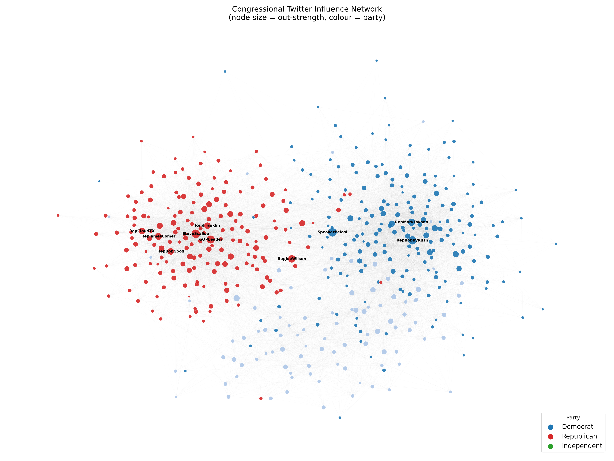

*Figure 1 — Network overview (node size = out-strength, colour = party). The layout is force-directed — nodes that interact frequently are pulled closer together. Partisan clusters appear visually separated because they have dense internal edges and sparse cross-cluster edges. Highly central nodes tend to appear in dense regions of their cluster, but their position reflects structural proximity, not a direct encoding of centrality scores.*

---

## Network Analysis

### Network Structure

| Metric | Value |
|---|---|
| Nodes | 475 |
| Directed edges | 13,289 |
| Average in-degree | 27.98 |
| Average out-degree | 27.98 |
| Graph density | 0.059 |
| Reciprocity | 0.46 |
| Weakly connected components | 1 |
| Strongly connected components | 7 |
| Largest SCC | 469 of 475 |
| Diameter | 4 |
| Average path length | 2.06 hops |
| Average clustering coefficient | 0.30 |

The network is **weakly connected** — every member is reachable from every other ignoring direction. The short average path (2.06 hops) and high clustering coefficient (0.30, versus ≈ 0.06 expected in a random graph of equivalent size) identify this as a **small-world network**: every member can be reached quickly, yet members form tight local groups. A **reciprocity of 0.46** means nearly half of influence ties are mutual, indicating both one-way broadcasting and two-way peer exchange.

---

### Research Questions

---

#### Community Differences

*How can Congress members be categorised on Twitter, and how do these groups differ from one another?*

**Defining communities by party (Homophily)**

**Homophily** — the tendency to connect with similar others — is a primary driver of community formation. Party affiliation is the strongest measurable similarity attribute, so communities are defined directly from metadata:

| Community | Size | Share of network |
|---|---|---|
| Democrat | 205 | 43.2% |
| Republican | 178 | 37.5% |
| Other / Unknown | 92 | 19.4% |

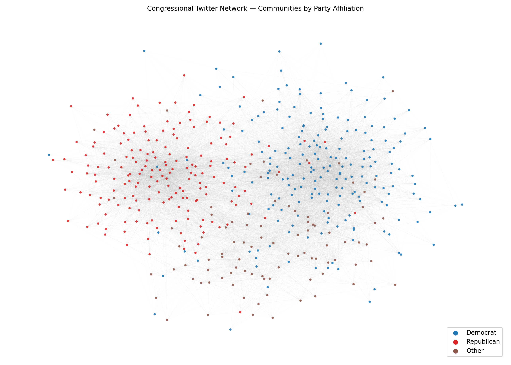

*Figure 2 — Network coloured by party affiliation (blue = Democrat, red = Republican, brown = Other/Unknown).*

**Are these communities structurally real? — Strong Community Test**

A community is classified as **strong** if its internal edge density exceeds its external edge density. To apply this, we compute the directed edges falling within each group versus those crossing into other groups, normalised by the number of possible edges in each case.

All three communities pass by a wide margin:

| Community | Internal density | External density | Ratio | Result |
|---|---|---|---|---|
| Democrat | 0.1639 | 0.0352 | 4.7× | **Strong** |
| Republican | 0.2084 | 0.0275 | 7.6× | **Strong** |
| Other/Senate | 0.2501 | 0.0432 | 5.8× | **Strong** |

All three communities satisfy this condition by a large margin (4.7–7.6×), confirming they are **tightly connected internally and weakly connected externally**. This reflects genuine social clustering driven by shared political identity, not a statistical artefact.

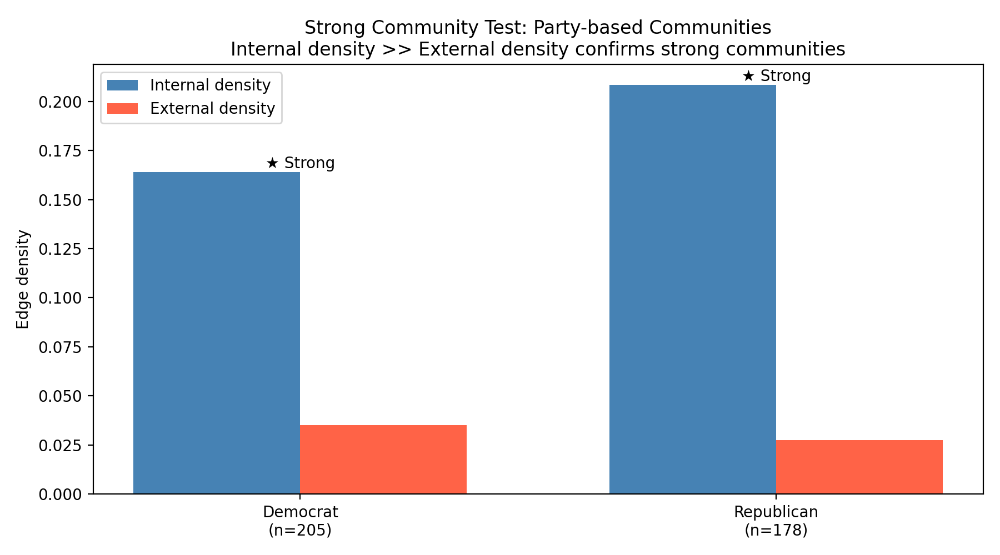

*Figure 3 — Strong Community Test: internal vs external edge density per party group. All three bars show internal density far exceeding external density.*

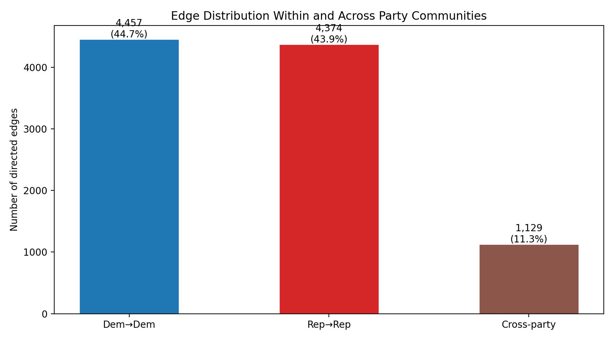

*Figure 4 — Absolute edge count within and across party communities. Within-party edges dominate overwhelmingly.*

**How do the communities differ? — K-core Decomposition**

The **k-core decomposition** identifies the densest, most cohesive subgraph. A node belongs to the k-core if it has at least *k* connections to other nodes within the same core. Nodes are iteratively removed if they have fewer than *k* neighbours, until only a stable mutually-connected group remains.

At k = 27, **201 nodes remain** — each connected to at least 27 others in the same core.

| Party | In k=27 core | Share of core | Share of full network |
|---|---|---|---|
| Democrat | 109 | **54.2%** | 43.2% |
| Republican | 88 | **43.8%** | 37.5% |
| Unknown | 4 | 2.0% | 19.4% |

Democrats are overrepresented in the inner core by 11 percentage points. A node in the inner core is connected to *other well-connected nodes*, forming a mutually reinforcing cluster where information diffuses rapidly. Republicans have higher per-node internal density (0.21) but this is concentrated in a smaller, tighter set rather than distributed across a broad coordinated backbone.

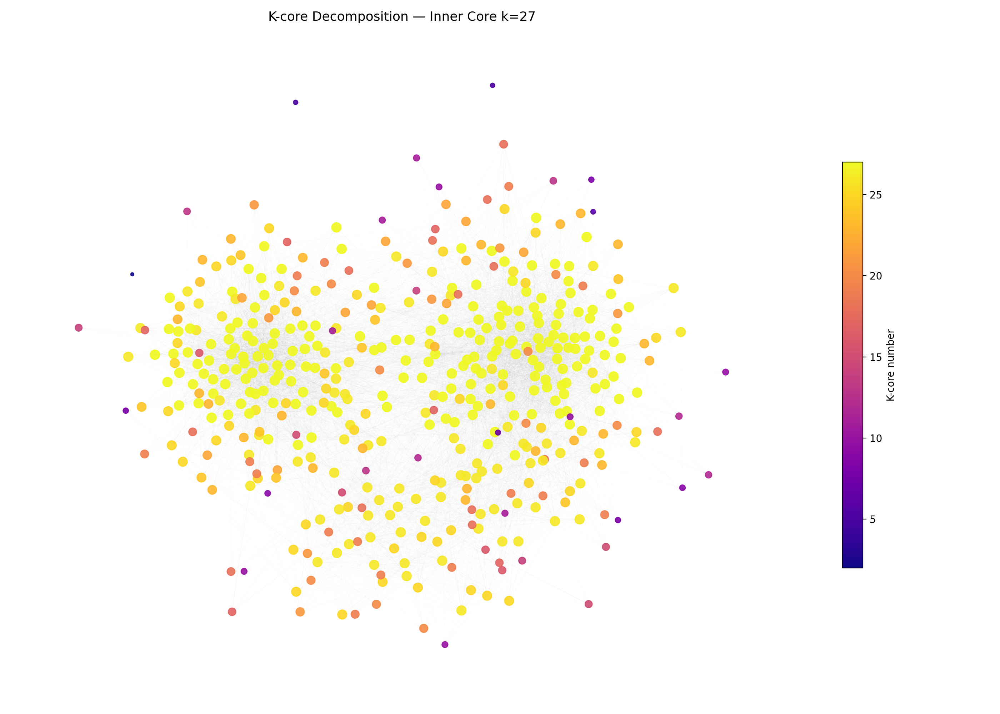

*Figure 5 — K-core decomposition network. Deeper/brighter colour = higher k-shell value, indicating more tightly embedded membership.*

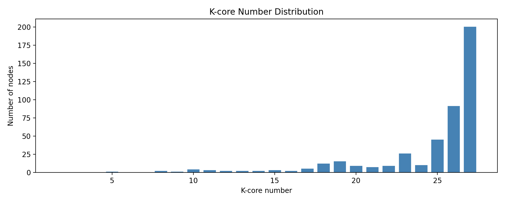

*Figure 6 — Distribution of k-core numbers across all 475 nodes. The long tail confirms the existence of a compact, densely connected inner core.*

> **Finding:** Party affiliation defines three structurally strong communities (internal density 4.7–7.6× external). Republicans form the denser per-node community; Democrats dominate the k=27 inner core (54.2% vs 43.2% baseline), indicating broader structural coordination across a larger group.

---

#### Focus on Influence

*Who are the most influential members, and is influence balanced across parties?*

Influence is measured using six centrality metrics plus **Viral Centrality (VC)** — which uses edge weights as Independent Cascade transmission probabilities and estimates how many members a node can activate through the network.

**Top 10 by Viral Centrality:**

| Rank | Member | Party | VC | Betweenness | Out-Strength |
|---|---|---|---|---|---|
| 1 | SteveScalise | Republican | 1.146 | 0.012 | 0.935 |
| 2 | SpeakerPelosi | Democrat | 1.112 | 0.046 | 0.944 |
| 3 | RepBobbyRush | Democrat | 1.007 | 0.026 | 0.869 |
| 4 | GOPLeader | Republican | 0.980 | **0.078** | 0.827 |
| 5 | RepJoeWilson | Republican | 0.810 | 0.006 | 0.695 |
| 6 | RepJamesComer | Republican | 0.784 | 0.002 | 0.603 |
| 7 | RepMarkTakano | Democrat | 0.781 | 0.002 | 0.650 |
| 8 | RepBobGood | Republican | 0.687 | 0.001 | 0.541 |
| 9 | RepCloudTX | Republican | 0.674 | 0.000 | 0.526 |
| 10 | RepFranklin | Republican | 0.646 | 0.013 | 0.518 |

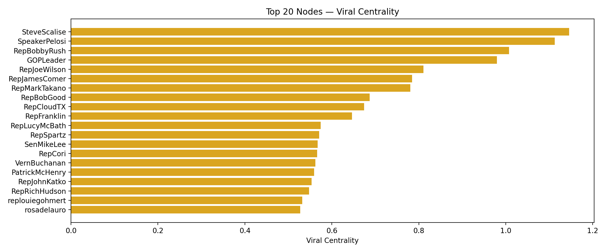

*Figure 7 — Top 20 members by Viral Centrality. Republicans hold 6 of the top 10 positions.*

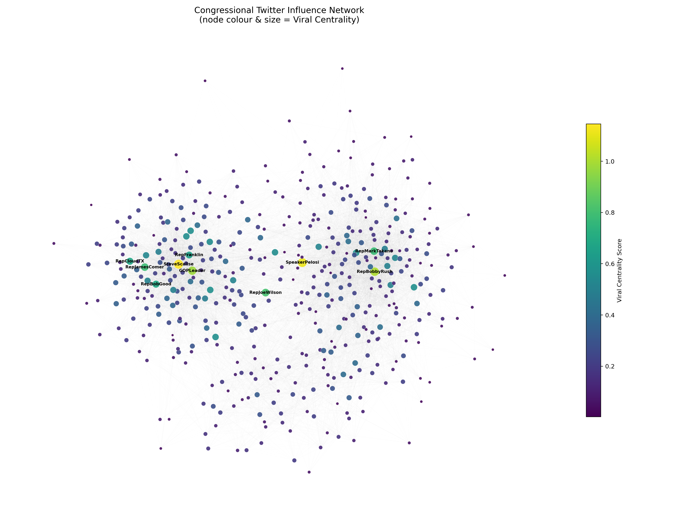

*Figure 8 — Network coloured by Viral Centrality score. Brighter nodes activate more members in the cascade model. High-VC nodes cluster toward the centre of their partisan community, reflecting dense local connectivity.*

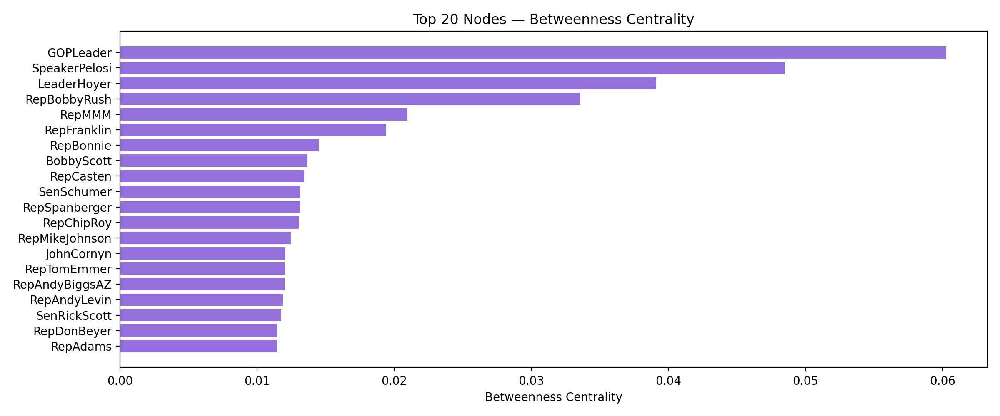

*Figure 9 — Top 20 members by Betweenness Centrality. GOPLeader ranks first — a different ordering from VC, highlighting its broker role.*

Viral Centrality and out-strength rankings correlate strongly (r > 0.95), indicating influence propagation is driven primarily by **broadcasting volume** rather than topological position — members who send more interactions reach more downstream nodes.

**GOPLeader is the structural exception:** despite ranking 4th in VC, it holds the highest betweenness (0.078) and eigenvector centrality (0.267) in the network — identifying it not as the loudest broadcaster, but as the **most strategically positioned node** through whom inter-community information routing passes.

**SpeakerPelosi** is the only member in the top two on both VC and betweenness, confirming a dual role as spreader and broker.

Of the top 10 by VC, 6 are Republican and 4 are Democrat. Republicans dominate individual VC rankings; Democrats dominate the inner coordination core — two structurally distinct but equally relevant forms of network power.

> **Finding:** Top influencers by Viral Centrality (SteveScalise, SpeakerPelosi, GOPLeader) correspond to real-world Congressional leadership. Influence is broadcasting-driven. GOPLeader serves as the network's primary structural broker, while SpeakerPelosi uniquely combines high spreading and high brokerage.

---

#### Cross-Party Influence

*To what extent is there cross-party influence, and are there critical bridging nodes?*

While community analysis establishes that party groups are structurally strong, this section examines how they interact. The network exhibits strong **homophily**, with 88% of edges occurring within the same party and only 12% crossing party lines, indicating pronounced echo chambers. Members primarily engage with like-minded peers, reinforcing existing views rather than facilitating cross-party persuasion. Influence largely remains confined within communities, and only a small number of bridging nodes (gatekeepers) play a critical role in enabling cross-party information flow.

---

**Part 1 — Overall Homophily: How extreme is the echo chamber?**

| Flow | Edges | Share |
|---|---|---|
| Within-party | 8,831 | **88.1%** |
| Cross-party | 1,197 | **11.9%** |

Strong ties (weight above the median, i.e., transmission probability > 0.0038) are even more partisan: **70% are within-party; only 9% cross party lines as strong ties**. This means the most intense, repeated interactions are almost exclusively internal — cross-party contact, where it exists, is predominantly weak and infrequent.

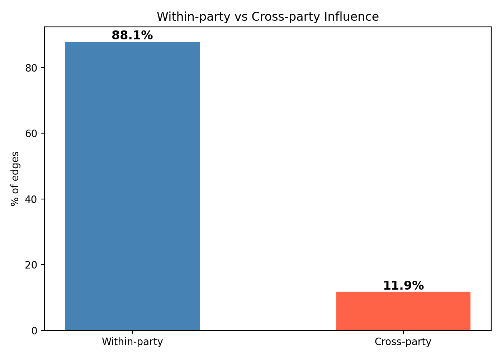

*Figure 10 — Within-party vs cross-party edge share. The 88/12 split confirms strong homophily.*

---

**Part 2 — Directional Flows: Which party influences the other more?**

| Source → Target | Edges | Total weight |
|---|---|---|
| Democrat → Democrat | 4,457 | 22.93 |
| Democrat → Republican | 589 | 2.97 |
| Republican → Democrat | 540 | 3.33 |
| Republican → Republican | 4,374 | 30.29 |

Republicans send slightly more cross-party influence weight (3.33) than Democrats (2.97) — a modest but consistent asymmetry. Republican-to-Republican total weight (30.29) substantially exceeds Democrat-to-Democrat (22.93), consistent with the higher per-node internal density observed in Community Differences.

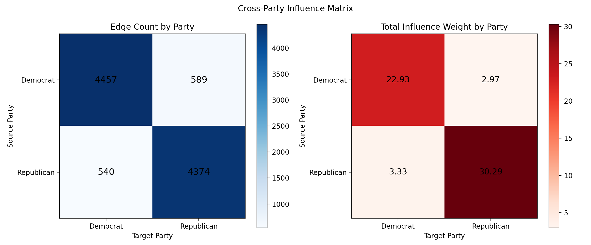

*Figure 11 — Cross-party influence heatmap. Diagonal cells (within-party) dominate both in edge count and total weight.*

---

**Part 3 — Gatekeepers: Who bridges the partisan divide?**

We identify members with the highest cross-party out-strength — those whose directed influence most frequently reaches across the partisan divide:

| Rank | Member | Party | Cross-party out-weight |
|---|---|---|---|
| 1 | RepJoeWilson | Republican | 0.295 |
| 2 | SpeakerPelosi | Democrat | 0.283 |
| 3 | RepBrianFitz | Republican | 0.179 |
| 4 | RepAnnWagner | Republican | 0.135 |
| 5 | RepJohnKatko | Republican | 0.120 |

Top bridgers are predominantly moderate Republicans, with SpeakerPelosi as the sole Democrat. Critically, **there are zero formal bridges and zero articulation points** in the network — these gatekeepers are important relatively, not absolutely: their removal would not fragment the network structurally, but would disproportionately reduce cross-party signal.

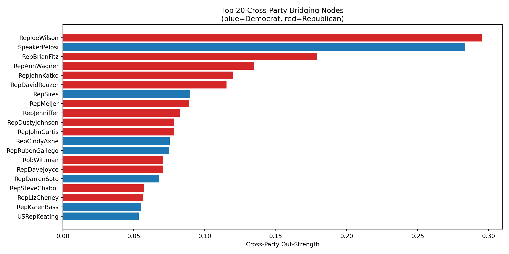

*Figure 12 — Top cross-party bridging nodes by cross-party out-weight. Blue bars = Democrat, red = Republican.*

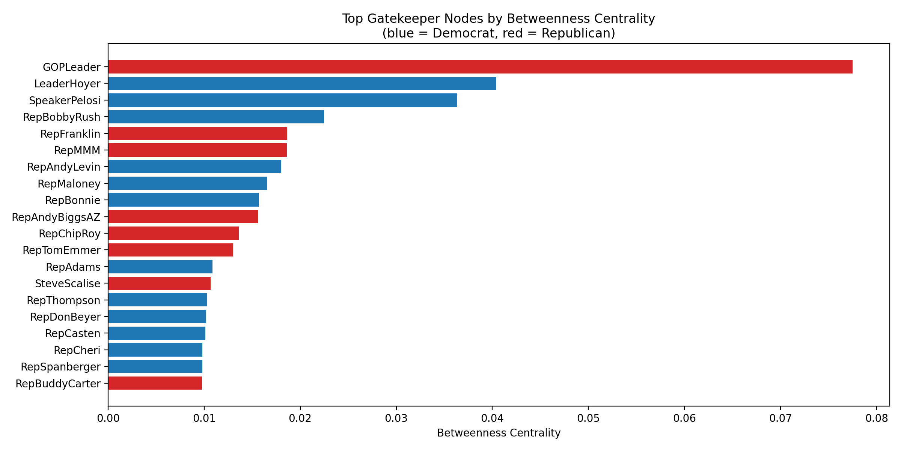

*Figure 13 — Top gatekeeper nodes by betweenness centrality. GOPLeader and SpeakerPelosi lead, confirming their broker positions across the partisan divide.*

---

**Part 4 — Ego Networks: Two contrasting interaction styles**

Examining the ego networks of the top two VC members illustrates the structural difference between intra-party amplification and cross-party reach:

| | SteveScalise | SpeakerPelosi |
|---|---|---|
| Ego network size | 103 | 215 |
| Own-party share | 94% | 68% |
| Cross-party neighbours | 4 | 66 |
| Reciprocated edges | 57% | — |

SteveScalise's ego network is almost entirely Republican and densely reciprocated — a tight intra-party echo cluster. SpeakerPelosi's is more than twice as large with 66 Republican neighbours (31%), making her structurally unique as both a high-VC broadcaster and a genuine cross-party hub.

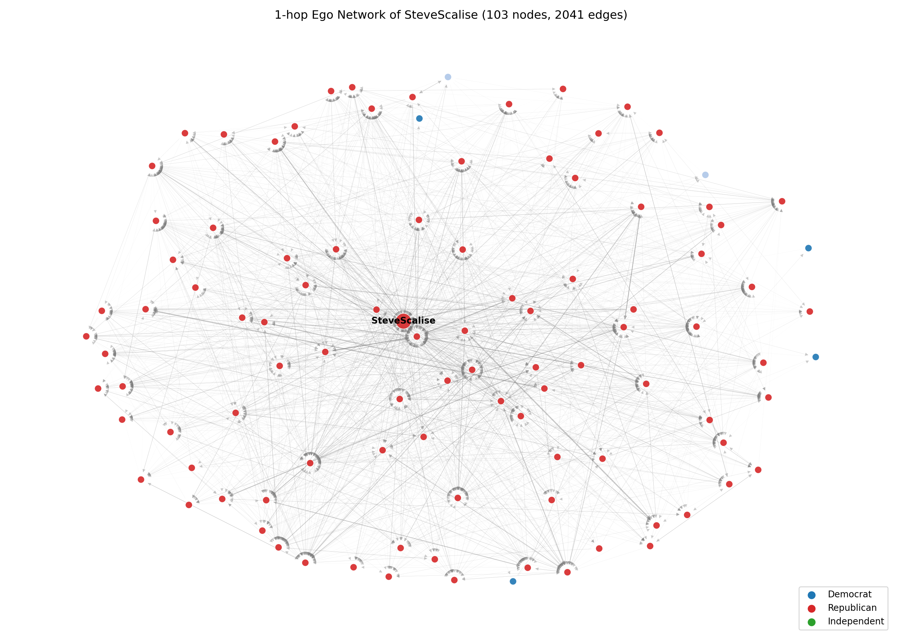

*Figure 14 — Ego network of SteveScalise (Republican Whip). Predominantly Republican (94%), dense and reciprocated — a textbook intra-party amplification cluster.*

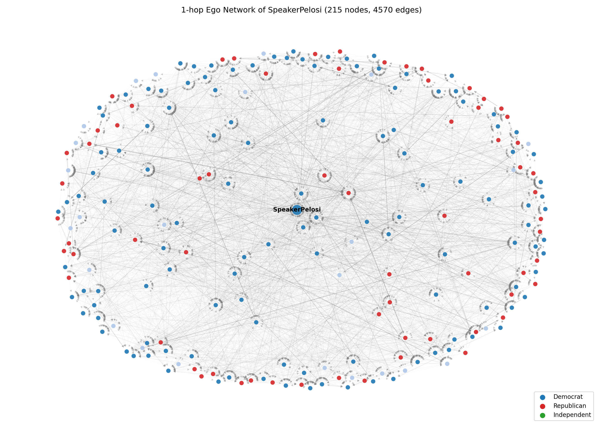

*Figure 15 — Ego network of SpeakerPelosi (Democrat Speaker). Broader network with 31% Republican neighbours — a cross-party hub rather than a partisan echo cluster.*

> **Finding:** Cross-party influence is structurally marginal — 88% of edges stay within party. Republicans send slightly more cross-party weight than Democrats. A small set of gatekeepers (RepJoeWilson, SpeakerPelosi, RepBrianFitz) carry disproportionate responsibility for cross-party communication. The Scalise vs Pelosi ego network contrast illustrates the two dominant modes: intra-party amplification versus cross-party brokerage.

---

## Implications

**1. Echo chambers limit cross-partisan discourse**

The extreme within-party homophily (88%) confirms that Congressional Twitter functions primarily as an intra-party amplification system rather than a cross-partisan debate platform. Platform designers could use network analysis to identify members with low cross-party exposure and prioritise cross-partisan content recommendations. The rare gatekeeper nodes (Fitzpatrick, Katko, Wilson) represent the most efficient leverage points: amplifying their content to the opposite party's audience would produce the highest per-node increase in cross-partisan exposure.

**2. Two types of influence require different communication strategies**

The divergence between Viral Centrality and betweenness rankings has practical implications for political communication. High-VC nodes (Scalise, Rush) are powerful intra-community amplifiers but primarily reach their own party. High-betweenness nodes (GOPLeader, SpeakerPelosi) sit on more cross-community shortest paths. A two-stage communication strategy — seed the message via a high-betweenness broker to cross party lines, then let high-VC nodes amplify within each community — would maximise network-wide diffusion.

---

## Conclusion and Limitation

### Summary of findings

| Research Question | Key Finding |
|---|---|
| **Community differences** | Three party-based communities, all structurally strong (internal density 4.7–7.6× external). Republicans have higher per-node density; Democrats are overrepresented in the k=27 inner core (54.2% of core vs 43.2% of network). |
| **Focus on influence** | Top spreaders mirror real-world leadership. VC correlates with out-strength (r > 0.95). GOPLeader is the primary structural broker (highest betweenness + eigenvector). Republicans dominate top-10 VC; Democrats dominate inner-core cohesion. |
| **Cross-party influence** | 88% of edges stay within party. Gatekeepers (RepJoeWilson, SpeakerPelosi, RepBrianFitz) enable limited cross-party flow. Zero structural bridges or articulation points — network is resilient but deeply polarised. |

The analysis reveals two structurally distinct forms of network power. **Individual influence** (VC, out-strength) is concentrated in high-volume Republican broadcasters. **Collective coordination** (k-core membership) is concentrated among Democrats. Individual reach spreads messages widely within a community; inner-core coordination enables sustained reciprocated engagement across a large, tightly-knit group. The interaction between these two forms of power, combined with extreme within-party homophily (88%), defines the fundamental structure of Congressional Twitter communication during this period.

### Limitations

1. **Temporal snapshot**: 4 months of 2022; patterns may shift during elections or major legislative votes.
2. **Activity bias**: members tweeting fewer than 100 times are excluded, over-representing highly active voices.
3. **No content analysis**: edge weights capture *frequency* of interaction, not *nature* — a critical quote-tweet is treated identically to an endorsement.
4. **Missing metadata**: 92 nodes lack party/chamber labels, limiting precision of community analysis.

---

## Reproducibility

The analysis was conducted using Python 3.11 with the NetworkX, matplotlib, numpy, scipy, and openpyxl libraries. The original edgelist was read directly using NetworkX to preserve edge direction and weights. All computations (centrality, community strength, k-core, homophily) were performed programmatically in Python to ensure reproducibility.

Scripts are located in `group project/codes/`. Run in order:

```bash
cd "group project/codes"
python3 02_centrality.py          # Centrality measures + Viral Centrality
python3 03_community.py           # Party communities + strong community test
python3 04_cross_party.py         # Homophily + bridging nodes
python3 05_egocentric.py          # Ego network analysis
python3 07_network_viz.py         # Network visualisations
python3 08_community_advanced.py  # K-core, homophily bar, gatekeeper analysis
```

Figures are saved to `codes/figures/` and results to `codes/results/`.

---

## References

Fink, C. G., Omodt, N., Zinnecker, S., & Sprint, G. (2023). A Congressional Twitter network dataset quantifying pairwise probability of influence. *Data in Brief, 50*, 109521.

Fink, C., Fullin, K., Gutierrez, G., Omodt, N., Zinnecker, S., Sprint, G., & McCulloch, S. (2023). A centrality measure for quantifying spread on weighted, directed networks. *Physica A, 626*, 129083.

Stanford University. (n.d.). *SNAP: Network datasets: Twitter Interaction Network for the US Congress.* https://snap.stanford.edu/data/congress-twitter.html

---

## Declaration of AI Tool Usage

| AI Tool | How it was used |
|---|---|
| AI language model (large language model assistant) | Assisted with writing Python analysis scripts, structuring the Markdown report, and generating figure-production code. All analytical interpretations, research questions, and conclusions were reviewed and verified by the group. |

---

## Appendix A

### Full Centrality Table (Top 20)

Full 475-node table available at: `codes/results/centrality_table.csv`

| Username | Party | Chamber | Out-Deg | In-Deg | Out-Str | In-Str | Betweenness | Closeness | Eigenvector | VC |
|---|---|---|---|---|---|---|---|---|---|---|
| SteveScalise | Republican | House | 187 | 118 | 0.935 | 0.642 | 0.012 | 0.479 | 0.120 | 1.146 |
| SpeakerPelosi | Democrat | House | 210 | 94 | 0.944 | 0.278 | 0.046 | 0.479 | 0.094 | 1.113 |
| RepBobbyRush | Democrat | House | 173 | 113 | 0.869 | 0.374 | 0.026 | 0.464 | 0.111 | 1.007 |
| GOPLeader | Republican | House | 195 | 127 | 0.827 | 1.648 | 0.078 | 0.476 | 0.267 | 0.980 |
| RepJoeWilson | Republican | House | 153 | 82 | 0.695 | 0.255 | 0.006 | 0.459 | 0.085 | 0.811 |
| RepJamesComer | Republican | House | 140 | 76 | 0.603 | 0.302 | 0.002 | 0.451 | 0.074 | 0.784 |
| RepMarkTakano | Democrat | House | 151 | 107 | 0.650 | 0.271 | 0.002 | 0.455 | 0.073 | 0.781 |
| RepBobGood | Republican | House | 133 | 74 | 0.541 | 0.197 | 0.001 | 0.447 | 0.066 | 0.687 |
| RepCloudTX | Republican | House | 130 | 68 | 0.526 | 0.217 | 0.000 | 0.446 | 0.066 | 0.675 |
| RepFranklin | Republican | House | 138 | 127 | 0.518 | 0.830 | 0.013 | 0.453 | 0.130 | 0.646 |
| RepTomEmmer | Republican | House | 130 | 105 | 0.474 | 0.711 | 0.018 | 0.453 | 0.116 | 0.587 |
| RepMMM | Republican | House | 112 | 117 | 0.430 | 0.728 | 0.020 | 0.448 | 0.107 | 0.549 |
| GOPWhip | Republican | House | 128 | 93 | 0.486 | 0.545 | 0.008 | 0.451 | 0.094 | 0.543 |
| RepAndyBiggsAZ | Republican | House | 103 | 92 | 0.425 | 0.639 | 0.014 | 0.445 | 0.091 | 0.494 |
| RepCasten | Democrat | House | 96 | 88 | 0.293 | 0.814 | 0.007 | 0.434 | 0.091 | 0.411 |
| RepAndyLevin | Democrat | House | 95 | 76 | 0.313 | 0.633 | 0.017 | 0.434 | 0.077 | 0.388 |
| RepDonBeyer | Democrat | House | 83 | 79 | 0.273 | 0.637 | 0.006 | 0.427 | 0.072 | 0.354 |
| RepChipRoy | Republican | House | 86 | 119 | 0.278 | 0.952 | 0.005 | 0.431 | 0.101 | 0.354 |
| LeaderHoyer | Democrat | House | 79 | 65 | 0.290 | 0.401 | 0.030 | 0.432 | 0.063 | 0.340 |
| RepBonnie | Democrat | House | 67 | 68 | 0.220 | 0.492 | 0.015 | 0.426 | 0.062 | 0.316 |
